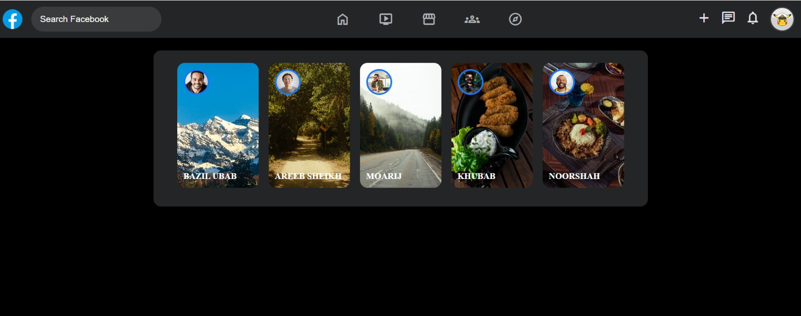

<div align="center">

  <!-- Animated Header Banner -->
  

  <br/>

  <!-- Tagline -->
  <p align="center">
    <b>✨ A Pixel-Perfect, High-Performance Facebook UI Clone Component ✨</b><br>
    <i>Crafted with pure HTML5 & CSS3 featuring modern Flexbox layouts & smooth dark mode styling.</i>
  </p>

  <!-- Glowing Badges -->
  <p align="center">
    
    
    
    
  </p>

</div>

<br/>

---

## 🎨 Interactive Preview

<div align="center">

  <details>
    <summary>🔍 <b>Click to Toggle Full Component View</b></summary>
    <br/>
    
  </details>

</div>

<br/>

---

## ⚡ What Makes This Unique?

<table>
  <tr>
    <td width="50%">
      <h3>🎯 Navigation & Header</h3>
      <ul>
        <li><b>Integrated Search Bar:</b> Clean dark-pill input with custom placeholder styling.</li>
        <li><b>Navigation Center:</b> Quick-access tab icons with smooth hover transitions.</li>
        <li><b>User Quick Menu:</b> Add, Chat, and Notification action icons paired with a bordered avatar.</li>
      </ul>
    </td>
    <td width="50%">
      <h3>🎴 Stories Showcase</h3>
      <ul>
        <li><b>Micro-Interactions:</b> Smooth <code>transform: scale(1.03)</code> zoom on hover.</li>
        <li><b>Branded Borders:</b> Profile avatars highlighted with Facebook's signature blue (<code>#1877f2</code>) rings.</li>
        <li><b>Pure CSS:</b> Zero JavaScript dependencies for lightning-fast rendering.</li>
      </ul>
    </td>
  </tr>
</table>

---

## 🛠️ Tech Stack & Specs

```text
📦 project-root
 ┣ 📜 index.html    # Semantic HTML structure & Google Material Symbols
 ┣ 🎨 style.css     # CSS Variables, Flexbox layouts, Fixed Header, & Hover Effects
 ┗ 🖼️ preview.png  # Project Interface Screenshot
